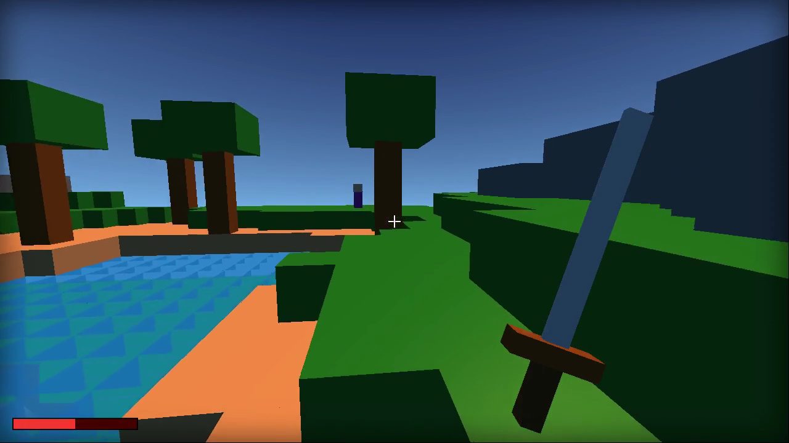

# doraemius-mimecraft-voxel-game

A Minecraft-style voxel game in one HTML file, written by a local AI: **Qwen3-Coder-30B-A3B**
on a single RTX 3080, over more than 40 prompts, one feature at a time. Three.js, no build step.

**Watch the video:** [Qwen3 Coder 30B Wrote a Minecraft-Style Game on One GPU — 40+ Prompts](https://www.youtube.com/watch?v=5M1_bqp6Bo0)



## Play it

Open **[`index.html`](index.html)** in a browser. No install, no server.

- Click to capture the mouse. **WASD** to move, **Space** to jump, **Shift** to sprint,
  **double-tap a direction** to dodge, **hold F** to raise your guard.
- **Left click**: swing the sword and break the block under the crosshair. **Right click**:
  place a block.
- Add **`?demo=1`** to the URL (`index.html?demo=1`) to watch the game play itself: a walk
  along the shore, two jumps, a sprint, a fight with three enemies, a dodge, then breaking and
  placing a block. It's driven by a frame counter, so every run is identical.

A 32-second recording of the demo is in [`media/gameplay-demo-60fps.mp4`](media/gameplay-demo-60fps.mp4).

## What's in it

Every line of `index.html` was written by the model. The only human edit in the whole project
is one line on day one, `camera.lookAt(...)`, and it's labelled. Features: a 32x32 world with
a lake, shoreline, slopes and stone ridges (two-octave value noise); trees; four wandering
characters; three enemies that chase, hit and can be killed; an HP bar; sword, guard, sprint and
dodge; block breaking and placing; `InstancedMesh` rendering (9 draw calls, down from 7,912).

## How it was made: three phases

| Phase | Folder | Prompts | What happened |
|---|---|---|---|
| 1. Day one | [`iterations/1-day-one`](iterations/1-day-one) | 4 | One prompt for the whole game spawned the player inside the ground. Plain-English and vision-model bug reports didn't fix it; a one-line hand edit did. |
| 2. Stacked attempt | [`iterations/2-stacked-attempt`](iterations/2-stacked-attempt) | 9 | Many features per prompt, checked from a METRICS line the game printed about itself. It reported 23,673 blocks and zero errors while the screen was blank grey from v6 onward. |
| 3. Rebuild | [`iterations/3-rebuild`](iterations/3-rebuild) | 22 rounds + retries | Started again from one cube. One feature per round, and a gate on the rendered frame before anything was promoted. `round-22.html` is `index.html`. |

**Every prompt is in [`PROMPTS.md`](PROMPTS.md)**, verbatim, in order.

What the rebuild showed (details in [`notes/REBUILD-LOG.md`](notes/REBUILD-LOG.md)):

- **Describe an outcome and it improvises; give it the computation and it implements it.**
  "Spawn on a column whose neighbours aren't taller" failed three times; an explicit camera
  formula worked first try. Described hills came out as confetti, then stripes; a pasted noise
  formula gave a lake and ridges.
- **A screenshot is not a review.** Four real bugs passed the rendered-frame gate: the lake and
  every tree canopy deleted (round 14), a sword that could never hit (17), a game that froze after
  one frame (19, caused by the prompt's wording), and W walking backwards since round 4. Reading
  the diff caught all four; every fix was one or two lines.

## Folder map

```text
index.html              the final game (= iterations/3-rebuild/round-22.html)
PROMPTS.md              every prompt, verbatim, in order
iterations/
  1-day-one/            v1-v5, screenshots
  2-stacked-attempt/    v6-v13
  3-rebuild/            round-01..22.html (each promoted build)
    attempts/           first attempts that failed or hid a defect (round-NN-a.html)
    experiments/        sampling A/B and KV-cache precision runs
    screenshots/        per-round frames and before/after comparisons
media/
  gameplay-demo-60fps.mp4   the ?demo=1 run, captured on the GPU at 60 fps
  broll/                    8 s orbit clips of the rebuild rounds; v1/v3/v8 as the player saw them
tools/                  the scripts that sent every prompt, the pixel gate, capture and probes
notes/                  REBUILD-LOG.md (round by round), CAPTURE-GAMEPLAY.md
```

The orbit clips in `media/broll/` use a presentation camera added for the video
(`tools/3-rebuild/presentation-camera.py`, marked "NOT MODEL CODE" in the file). The world in
them is the model's own.

## Reproduce it

The tools expect an OpenAI-compatible endpoint at `localhost:8080` serving
[Qwen3-Coder-30B-A3B-Instruct](https://huggingface.co/Qwen/Qwen3-Coder-30B-A3B-Instruct) (Apache
2.0) via llama.cpp's `llama-server` (Q4_K_XL, about 8 GB of VRAM), with an API key in
`~/.config/llama-server/api-keys`. Temperature 0.2. The rebuild driver is
`tools/3-rebuild/game-rounds.py <round>`; the gate is `tools/3-rebuild/game-gate.py`, which needs
Chrome and Pillow.

## Credits and notices

- Code written by Qwen3-Coder-30B-A3B-Instruct (Apache 2.0) from human prompts.
  [three.js](https://threejs.org) (MIT) is loaded from a CDN at runtime.
- **Not affiliated with or endorsed by Mojang Studios or Microsoft.** "Minecraft-style"
  describes the look. No Mojang assets, code, textures or sounds are used.
- Made for the Doraemius YouTube channel.

## License

[MIT](LICENSE).
